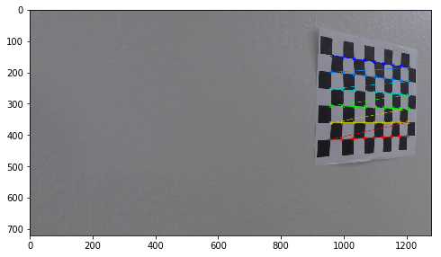
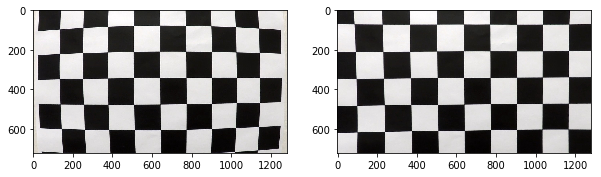

# Advanced Lane Lines 

### Ren Silva - Udactiy

---

[//]: # (Image References)

[image1]: ./examples/undistort_output.png "Undistorted"


### Camera Calibration

#### 1. Briefly state how you computed the camera matrix and distortion coefficients. Provide an example of a distortion corrected calibration image.

The code for this step is contained in method `LaneDetector.calibrate_camera()` in file [./advanced_lane_lines/detect_lanes.py](./advanced_lane_lines/detect_lanes.py)

I start by preparing `object points`, which will be the (x, y, z) coordinates of the chessboard corners in the world. Here I am assuming the chessboard is fixed on the (x, y) plane at z=0, such that the object points are the same for each calibration image.  

Thus, `objp` is just a replicated array of coordinates, and `objpoints` will be appended with a copy of it every time I successfully detect all chessboard corners in a test image.  `imgpoints` will be appended with the (x, y) pixel position of each of the corners in the image plane with each successful chessboard detection.  

I then used the output `objpoints` and `imgpoints` to compute the camera calibration and distortion coefficients using the `cv2.calibrateCamera()` function.  I applied this distortion correction to the test image using the `cv2.undistort()` function and obtained this result: 

![alt text][image1]

The next cell (just below this cell) contains a call to the calibration method `LaneDetector.calibrate_camera()` with the images provided in folder [./camera_cal/](./camera_cal) (this part is marked as **training**)

Then, I have used the coefficients to undistort the same images (marked as **testing**)


```python
import matplotlib.pyplot as plt
import matplotlib.image as mping
import numpy as np
import cv2
from glob import glob

%matplotlib inline

from advanced_lane_lines.detect_lanes import LaneDetector


HLS_THRESH = (80, 255) 
COLOUR_THRESH = (150, 255)

lane_detector = LaneDetector(hls_thresh=HLS_THRESH,colour_thresh=COLOUR_THRESH)


'''
STEP 0 -> Camera Calibration - demo
'''

images = glob("./camera_cal/*")

lane_detector.calibrate_camera(images,test_files=images,verbose=1)
```

    
    Calibrating camera...
    
    Training...





    
    Testing...





    
    Finished Calculating calibration coefficients


----
[image2]: ./test_images/test1.jpg "Road Transformed"

### Pipeline (single images)

#### 1. Provide an example of a distortion-corrected image.

To demonstrate this step, I will describe how I apply the distortion correction to one of the test images like this one:
![alt text][image2]

----
## Step 1 
One way to undistort an image **would be** simply calling the method `cv2.undistort()` passing the `lane_detector.mtx` and `detect_lanes.dist` worked out in the previous step.

However, my choice was to create a method in class `LaneDetector` in file [./advanced_lane_lines/detect_lanes.py](./advanced_lane_lines/detect_lanes.py). The method `LaneDetector.undistort()` remembers the coefficients worked out in the calibration, and work very similarly to `cv2.undistort()` - and this is the method that I will be calling from now on.

The cell below shows the method applied to one test image, from folder [./test_images/](./test_images):


```python
'''
STEP 1 -> Undistorting image using detect_lanes.mtx, detect_lanes.dist worked out in camera calibration
'''
img = mping.imread('./test_images/test1.jpg')

dst = lane_detector.undistort(img)

plt.figure(figsize=(20,10))
plt.imshow(dst)
plt.show()  
```

----
[image3]: ./examples/binary_combo_example.jpg "Binary Example"

#### 2. Describe how (and identify where in your code) you used color transforms, gradients or other methods to create a thresholded binary image.  Provide an example of a binary image result.

I used a combination of color and gradient thresholds to generate a binary image. I combined color (green) AND saturation OR a x-sobel filter. 

Below are 5 types of gradients and filters that I tried before settling for the combination of three of them (**combined**)

Eventually, I created a method called `LaneDetector.lane_binary()` (in file [./advanced_lane_lines/detect_lanes.py](./advanced_lane_lines/detect_lanes.py) ) - which I plan to use from now on.

Here are my studies in colour transforms before settling for a combination of them - testing images provided in folder [./test_images/](./test_images) 


```python
'''
STEP 2 -> Demostrate Colour Space Transforms: hls, colour (rgb), sobel, or mag_thresholding
'''
def demo_colour_space_transforms(file_name):
    
    img = mping.imread(file_name)

    dst = lane_detector.undistort(img)

    # now do gradient a transform to get a binary
    hls_binary = lane_detector.hls_select(dst)

    # now do colour gradient a transform to get a binary
    colour_binary = lane_detector.colour_select(dst)

    
#     # mag thresholding ... trial
#     mag_binary = lane_detector.mag_thresh(dst, sobel_kernel=3, mag_thresh=(30, 100))   
 
    lane_binary = lane_detector.lane_binary(dst)
    
    sob_binary = lane_detector.abs_sobel_thresh(dst, orient='x', thresh_min=30, thresh_max=100)

    print('\n\n',file_name)
    plt.figure(figsize=(20,10))

    plt.subplot(2,3,1)
    plt.title('Undistorted')
    plt.imshow(dst)

    plt.subplot(2,3,2)
    plt.title('HLS binary')
    plt.imshow(hls_binary,cmap='gray')

    plt.subplot(2,3,3)
    plt.title('Colour binary')
    plt.imshow(colour_binary,cmap='gray')

    plt.subplot(2,3,4)
    plt.title('Sobel x binary')
    plt.imshow(sob_binary,cmap='gray')
 
    plt.subplot(2,3,5)
    plt.title('Combined (lane) binary')
    plt.imshow(lane_binary,cmap='gray')

    # combining binaries ... this will be the content of method lane_binary()
    combined = np.zeros_like(hls_binary)
    combined[((hls_binary == 1) & (colour_binary == 1) | (sob_binary == 1))] = 1
    plt.subplot(2,3,6)
    plt.title('Combined')
    plt.imshow(combined,cmap='gray')
    plt.show()     
    
# read image
files = glob('./test_images/*')

for file in files:
    demo_colour_space_transforms(file)


```

    
    
     ./test_images/test6.jpg


    
    
     ./test_images/test5.jpg


    
    
     ./test_images/test4.jpg


    
    
     ./test_images/test1.jpg


    
    
     ./test_images/test3.jpg


    
    
     ./test_images/test2.jpg


    
    
     ./test_images/straight_lines2.jpg


    
    
     ./test_images/straight_lines1.jpg


----
[image4]: ./examples/warped_straight_lines.jpg "Warp Example"

#### 3. Describe how (and identify where in your code) you performed a perspective transform and provide an example of a transformed image.

The code for my perspective transform includes a method called `LaneDetector.warper()`, which appears in file [./advanced_lane_lines/detect_lanes.py](./advanced_lane_lines/detect_lanes.py).  

The `LaneDetector.warper()` method takes as inputs an image (`img`), as well as source (`src`) and destination (`dst`) points.  

I chose the hardcode the source and destination points in the following manner:

```python
self.src = np.float32(
    [[(img_size[0] / 2) - 55, img_size[1] / 2 + 100],
    [((img_size[0] / 6) - 10), img_size[1]],
    [(img_size[0] * 5 / 6) + 60, img_size[1]],
    [(img_size[0] / 2 + 55), img_size[1] / 2 + 100]])
self.dst = np.float32(
    [[(img_size[0] / 4), 0],
    [(img_size[0] / 4), img_size[1]],
    [(img_size[0] * 3 / 4), img_size[1]],
    [(img_size[0] * 3 / 4), 0]])
```

This resulted in the following source and destination points:

| Source        | Destination   | 
|:-------------:|:-------------:| 
| 585, 460      | 320, 0        | 
| 203, 720      | 320, 720      |
| 1127, 720     | 960, 720      |
| 695, 460      | 960, 0        |

I verified that my perspective transform was working as expected by drawing the `src` and `dst` points onto test images and their warped counterparts, verifying that the lines appear parallel in the warped images.

This was done all all images of provided in folder [./test_images/](./test_images) 


```python
'''
STEP 3 -> Demostrate how to warp images
'''

def demo_warper(file_name):
    
    img = mping.imread(file_name)

    imgu = lane_detector.undistort(img)

    lane_detector.set_src_dst((imgu.shape[1], imgu.shape[0]))

    warped = lane_detector.warper(imgu)

    plt.figure(figsize=(20,10))

    plt.subplot(1,3,1)
    plt.imshow(imgu)

    plt.subplot(1,3,2)
    plt.imshow(warped)
    
    imgu = lane_detector.lane_binary(warped)

    plt.subplot(1,3,3)
    plt.imshow(imgu,cmap='gray')

    plt.show()  

# read image
files = glob('./test_images/*')

for file in files:
    demo_warper(file)

```


----
#### 4. Describe how (and identify where in your code) you identified lane-line pixels and fit their positions with a polynomial?

Then I did some other stuff and fit my lane lines with a 2nd order polynomial kinda like this:

[image5]: ./examples/color_fit_lines.jpg "Fit Visual"

![alt text][image5]


```python
'''
STEP 4 -> Demostrate how to fit curves and find curvature
'''

def demo_lane_curv(file_name):
    
    img = mping.imread(file_name)

    imgu = lane_detector.undistort(img)
    
    lane_detector.set_src_dst((imgu.shape[1], imgu.shape[0]))

    warped = lane_detector.warper(imgu)

    plt.figure(figsize=(20,4))

    plt.subplot(1,3,1)
    
    # apply image thresholding and colour gradient
    imgu = lane_detector.lane_binary(warped)
    
    plt.imshow(imgu,cmap='gray')    

    plt.subplot(1,3,2)    

    with_lanes, left_fit_cr, right_fit_cr, offcentre_cr, position, ploty, polig_x, polig_y = lane_detector.fit_polynomial(imgu,plot=True)

    # Visualize the resulting histogram


    plt.subplot(1,3,2)
    plt.imshow(with_lanes)
    

    # Calculate the radius of curvature in meters for both lane lines
    left_curverad, right_curverad = lane_detector.measure_curvature_real(left_fit_cr, right_fit_cr, ploty)
    
    title = 'Curv(m): left={0:.0f} right={1:.0f} mean={2:.0f}'.format(left_curverad, right_curverad, (left_curverad +  right_curverad) / 2 )
    
    plt.title(title)
    
    plt.show()  

# read image
files = glob('./test_images/*')

for file in files:
    demo_lane_curv(file)
```


----

#### 5. Describe how (and identify where in your code) you calculated the radius of curvature of the lane and the position of the vehicle with respect to center.

I did this in methods `LaneDetector.measure_curvature_real()`, in file [./advanced_lane_lines/detect_lanes.py](./advanced_lane_lines/detect_lanes.py).

The method is defined in this tutorial [awesome tutorial](https://www.intmath.com/applications-differentiation/8-radius-curvature.php) - basically it is measuring the radius of the approximating circle to the curve.

It uses this formula:


Here's an example of my output for this step, testing images provided in in folder [./test_images/](./test_images) 

[image6]: ./examples/example_output.jpg "Output"

![alt text][image6]


#### 6. Provide an example image of your result plotted back down onto the road such that the lane area is identified clearly.

I implemented this step in the method `LaneDetector.map_lane()`, in file [./advanced_lane_lines/detect_lanes.py](./advanced_lane_lines/detect_lanes.py).

Here are examples of my results testing images provided in in folder [./test_images/](./test_images) 


```python
'''
STEP 6 -> Demostrate how to calculate the lane mask
'''  


def demo_draw_lanes(file_name):
    
    img = mping.imread(file_name)

    imgu = lane_detector.undistort(img)
    
    lane_detector.set_src_dst((imgu.shape[1], imgu.shape[0]))

    warped = lane_detector.warper(imgu)
    
    # apply image thresholding and colour gradient
    imgu = lane_detector.lane_binary(warped)
    

    with_lanes, left_fit_cr, right_fit_cr, offcentre_cr, position, ploty, polig_x, polig_y = lane_detector.fit_polynomial(imgu)
    

    # Calculate the radius of curvature in meters for both lane lines
    left_curverad, right_curverad = lane_detector.measure_curvature_real(left_fit_cr, right_fit_cr, ploty)
    
    messages = ['Radius of Curvature = {0:.0f}(m)'.format((left_curverad + right_curverad) / 2), 
                'Vehicle is {0:.2f}m {1:} of centre'.format(offcentre_cr,position) ]
    
    lm = lane_detector.map_lane(polig_x,polig_y,img,messages)

    plt.figure(figsize=(20,8))
    
    plt.imshow(lm)

    plt.show()  


    

# read image
files = glob('./test_images/*')

for file in files:
    demo_draw_lanes(file)
```

    /src/advanced_lane_lines/detect_lanes.py:347: FutureWarning: comparison to `None` will result in an elementwise object comparison in the future.
      if src == None:
    /src/advanced_lane_lines/detect_lanes.py:350: FutureWarning: comparison to `None` will result in an elementwise object comparison in the future.
      if dst == None:


----
[video1]: ./project_video.mp4 "Video"

### Pipeline (video)

#### 1. Provide a link to your final video output.  Your pipeline should perform reasonably well on the entire project video (wobbly lines are ok but no catastrophic failures that would cause the car to drive off the road!).

Here is a [link to my video result in this notebook](#Output-Video)

Here is a [link to my video result file](./output_images/project_video.mp4)


```python
'''
PIPELINE -> Demo the entire pipeline in a video
'''  

from moviepy.editor import VideoFileClip
from IPython.display import HTML

def process_image(image):
    # NOTE: The output you return should be a color image (3 channel) for processing video below
    # TODO: put your pipeline here,
    # you should return the final output (image where lines are drawn on lanes)
    result = lane_detector.find_lanes(image)
    
    return result

def process_video(video_file):
    white_output = './output_images/' + video_file
    ## To speed up the testing process you may want to try your pipeline on a shorter subclip of the video
    ## To do so add .subclip(start_second,end_second) to the end of the line below
    ## Where start_second and end_second are integer values representing the start and end of the subclip
    ## You may also uncomment the following line for a subclip of the first 5 seconds
    ##clip1 = VideoFileClip("test_videos/solidWhiteRight.mp4").subclip(0,5)
    clip1 = VideoFileClip(video_file)
    white_clip = clip1.fl_image(process_image) #NOTE: this function expects color images!!
    %time white_clip.write_videofile(white_output, audio=False)
    
    return(white_output)
```


```python
white_output = process_video("project_video.mp4")
```

    [MoviePy] >>>> Building video ./output_images/project_video.mp4
    [MoviePy] Writing video ./output_images/project_video.mp4


    100%|█████████▉| 1260/1261 [01:06<00:00, 18.91it/s]


    [MoviePy] Done.
    [MoviePy] >>>> Video ready: ./output_images/project_video.mp4 
    
    CPU times: user 1min 36s, sys: 3.65 s, total: 1min 40s
    Wall time: 1min 6s


### Output Video


```python
HTML("""
<video width="960" height="540" controls>
  <source src="{0}">
</video>
""".format(white_output))
```


<video width="960" height="540" controls>
  <source src="./output_images/project_video.mp4">
</video>


```python
white_output = process_video("challenge_video.mp4")
```

    [MoviePy] >>>> Building video ./output_images/challenge_video.mp4
    [MoviePy] Writing video ./output_images/challenge_video.mp4


    100%|██████████| 485/485 [00:24<00:00, 20.00it/s]


    [MoviePy] Done.
    [MoviePy] >>>> Video ready: ./output_images/challenge_video.mp4 
    
    CPU times: user 36.5 s, sys: 1.43 s, total: 37.9 s
    Wall time: 24.9 s


```python
HTML("""
<video width="960" height="540" controls>
  <source src="{0}">
</video>
""".format(white_output))
```


<video width="960" height="540" controls>
  <source src="./output_images/challenge_video.mp4">
</video>


```python
white_output = process_video("harder_challenge_video.mp4")
```

    [MoviePy] >>>> Building video ./output_images/harder_challenge_video.mp4
    [MoviePy] Writing video ./output_images/harder_challenge_video.mp4


    100%|█████████▉| 1199/1200 [01:16<00:00, 15.67it/s]


    [MoviePy] Done.
    [MoviePy] >>>> Video ready: ./output_images/harder_challenge_video.mp4 
    
    CPU times: user 1min 47s, sys: 3.29 s, total: 1min 50s
    Wall time: 1min 17s


```python
HTML("""
<video width="960" height="540" controls>
  <source src="{0}">
</video>
""".format(white_output))
```


<video width="960" height="540" controls>
  <source src="./output_images/harder_challenge_video.mp4">
</video>


----
### Discussion

#### 1. Briefly discuss any problems / issues you faced in your implementation of this project.  Where will your pipeline likely fail?  What could you do to make it more robust?

The solution to this problem is not simple to implement, has many moving parts and is prone to error.

The hardest part is to find a reliable method to find the lanes, when they exist. I ended up with a combination of colour (two colour spaces: RGB and HLS) and gradient (sobel) - which works better in as the lighting conditions work, but by no means is a reliable method.

I managed to get a consistent result in video 1 (hence I am submitting my project), but I can see how unreliable this method can be.

I do think that a deep-learning-based method will yield better results, provided we have enough videos with various lighting conditions, to train it.

Video 2 (which I attempted a few times with no success, but that I only partially succeeded), demonstrating how changing lighting conditions can lead to errors.

Video 3 is really hard - and my autonomous vehicle would really have a hard time staying in the lane.

Once the points that make up the lane lines are identifies, the method is straightforward. 

Another problem that I had was the method to change the perspective - the hardcoded points provided do not produce a good result in all conditions - and this led to errors in the calculation of the curvature.

Overall, I really enjoyed the challenge - it is good to see how hard it is to keep a vehicle on track with vision only.

And a final thought: If it is this hard to find lane lines when they do exist, imagine when they don't - and the latter is very prevalent.

It must be a serious challenge to drive autonomous vehicles where the roads are not so well mantained, and where lanes can't be seen.

